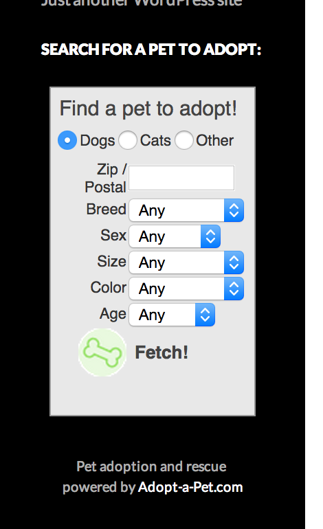

# Pet Adoption Search Widget

> Display an Adopt-a-Pet.com pet adoption search form in a widget.

    

## Description

This plugin creates a widget that will display pet adoption search form powered by Adopt-a-Pet.com.

Visitors to your site can choose what kind of pet to search for, enter their U.S. zipcode or Canadian postal code, and go search for adoptable pets near them. The search results will open in a new browser window or tab on the Adopt-a-Pet.com website.

Note that the plugin loads content from a third-party site via iframe, and so may introduce cookies, tracking codes, etc. in addition to those present on your WordPress site. This plugin and widget is in no way affiliated with or endorsed by Adopt-a-Pet.com or its partners.

### The widget front-end display

## Requirements

* [WordPress](http://wordpress.org) 2.8+

## Installation

Pet Adoption Search Widget is most easily installed automatically via the Plugins tab in your dashboard.

## Support Level

**Active:** I actively maintain this project, and expect to continue work for the foreseeable future including keeping tested up to the most recent version of WordPress.  Bug reports, feature requests, questions, and pull requests are welcome.

## Contributing

Pull requests and issues on [GitHub](https://github.com/ChrisHardie/pet-adoption-search-widget) are welcome.